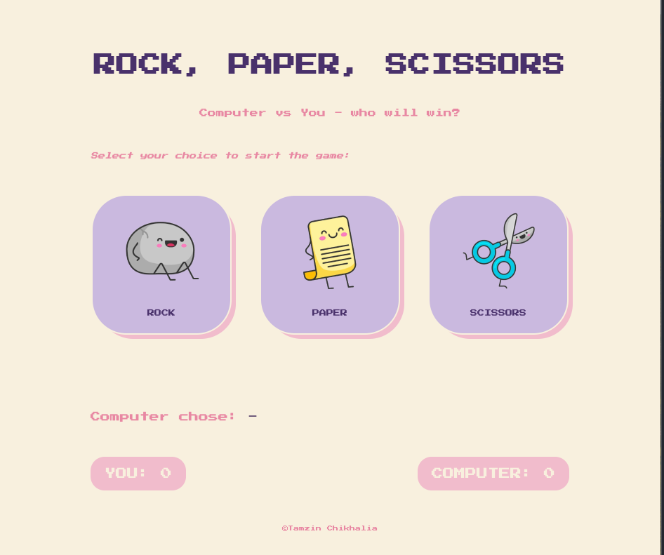
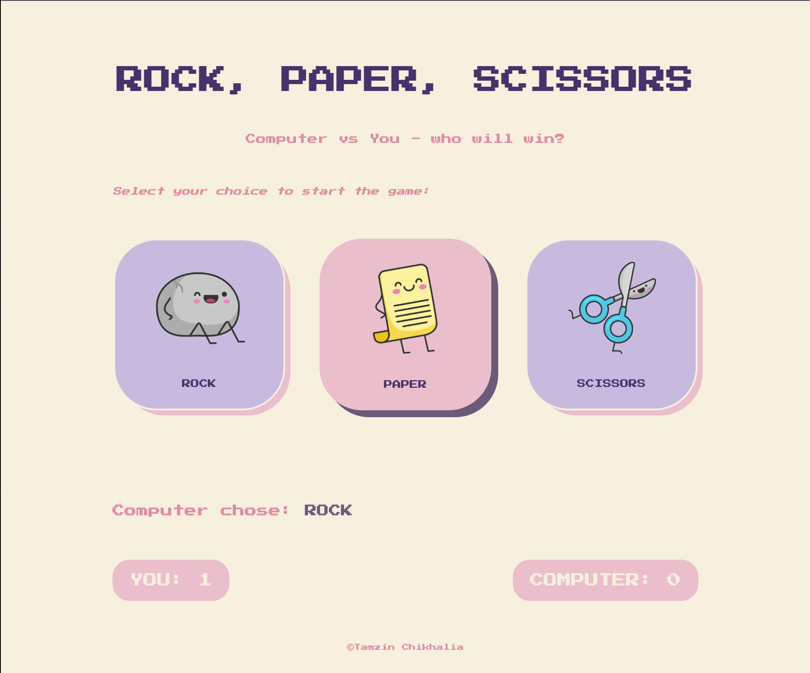
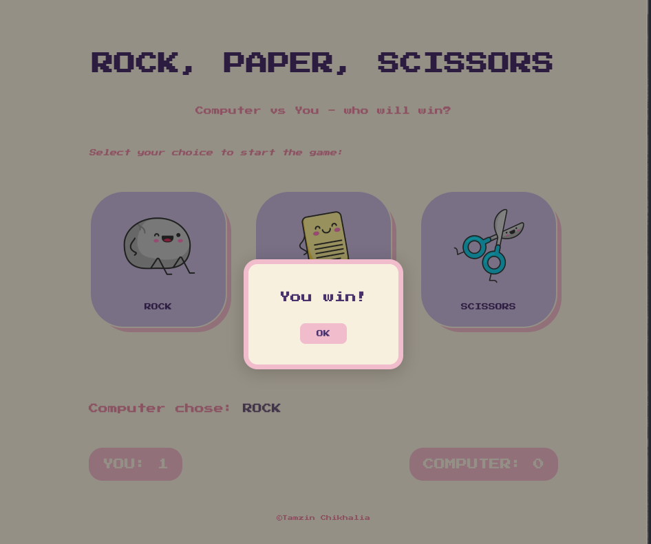

# Rock, Paper, Scissors

A simple Human vs Computer showdown using vanilla JavaScript.

## Table of Contents
- [Description](#description)
- [Tech Stack](#tech-stack)
- [Installation](#installation)
- [Usage](#usage)
- [Credits](#credits)
- [License](#license)

## Description

Inspired by the classic Rock, Paper, Scissors game, this is my take on the ultimate Human vs Computer showdown. Built using pure vanilla JavaScript and styled with CSS, the game allows the user to select their move while the Computer randomly selects its own using `Math.random()`. The winner is displayed instantly and a live score tally keeps track of the battle below. There is no time limit - play as many rounds as you like and see if you can outsmart the machine!

## Tech Stack
- HTML5
- CSS3
- JavaScript (ES6)

## Installation

No installation required - simply open the [live demo](https://tamzinc.github.io/rock_paper_scissors/) in your browser.

## Usage

Open the page using this link - [Play game here](https://tamzinc.github.io/rock_paper_scissors/)

When loaded you should be able to see this:

Start the game by clicking the button of your choice. The button will change colour when you hover over it, so you can see which one you are selecting:

Once you make your move, the Computer will immediately choose its move. The result is displayed straight away in a little pop-up window, which you can close to move onto the next round if you wish. The Computer's choice is also  displayed below the buttons for you to see:

You will also see a tally of the scores building up at the bottom of the screen as you play. Will you be able to outshine the Computer?

## Credits

N/A - This was a solo project built from scratch.

## License

This project is licensed under the MIT License.
